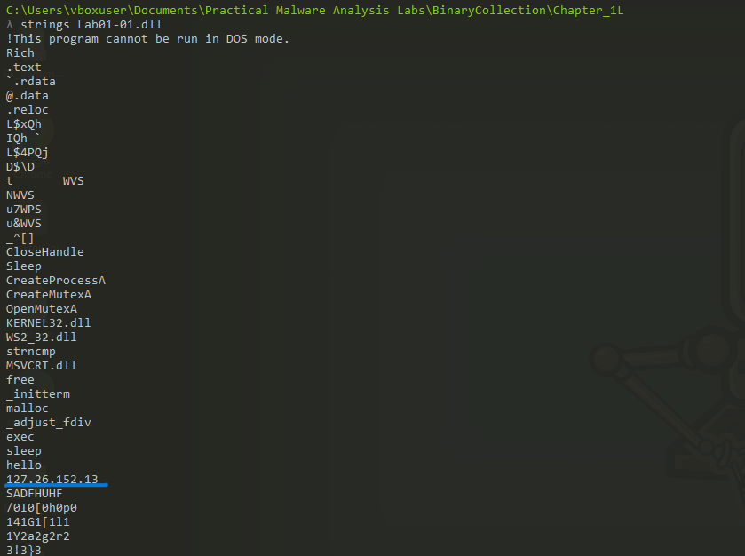
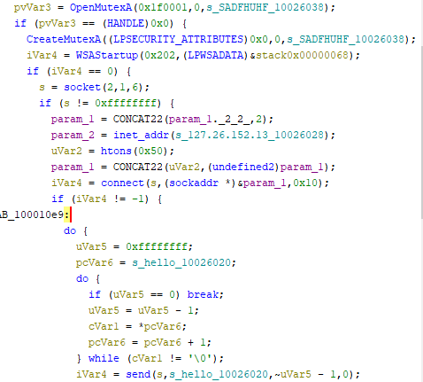

# LAB 1 - 01

## Q1: Existing antivirus signatures

Security Vendor's Analysis includes the likes of Trojan/Win32.Agent.C957604, Trojan.Agent.16384SS, Trojan.Ulise.D1BC1E, ...

## Q2: Time of compliation

2.Compiled Time: Sun Dec 19 16:16:19 2010 | UTC
Modified Time: 2012-01-08 02:19:04.340750000 +0700

## Q3: Packed

There are no signs of packing as the virtual size is smaller than the raw data size.

## Q4: Malware use 

- Functions used:
    - CloseHandle
    - UnmapViewOfFile
    - IsBadReadPtr
    - MapViewOfFile
    - CreateFileMappingA
    - CreateFileA
    - FindClose
    - FindNextFileA
    - FindFirstFileA
    - CopyFileA
    - malloc
    - exit
    - _XcptFilter
    - __p___initenv
    - __getmainargs
    - _initterm
    - __setusermatherr
    - _adjust_fdiv
    - __p__commode
    - __p__fmode
    - __set_app_type
    - _except_handler3
    - _controlfp
    - _stricmp
- Dynamic-Linked Libraries used:
    - MSVCRT.dll
    - KERNEL32.dll

**Imports**: These imports that certainly are very interesting in their own rights are:
    - UnmapViewOfFile
    - IsBadReadPtr
    - MapViewOfFile
    - CreateFileMappingA
    - CreateFileA
    - FindClose
    - FindNextFileA
    - FindFirstFileA
    - CopyFileA

**Conclusion** : The simplified version of this is that this malware reads, write files. The more complicated explaination is that the file opens several handles in reading and writing files as well as dll injection after finding lab01-01.dll used in it's code further down the line.

## Q5: Files or host-based indicators

**Recap on the keywords**: _Host-based signatures, or indicators, are used to detect malicious code on
victim computers. These indicators often identify files created or modified by
the malware or specific changes that it makes to the registry. Unlike antivirus
signatures, malware indicators focus on what the malware does to a system,
not on the characteristics of the malware itself, which makes them more
effective in detecting malware that changes form or that has been deleted
from the hard disk.
Network signatures are used to detect malicious code by monitoring net-
work traffic. Network signatures can be created without malware analysis, but
signatures created with the help of malware analysis are usually far more
effective, offering a higher detection rate and fewer false positives._

Looking deeper into the disassembled code, I found that it is trying to create file mapping of the system32 kernel.dll and it's very own lab011.dll. 


There is also a finding that there exists a function that iterates through all files in the system


```C
BVar9 = CopyFileA(s_Lab01-01.dll_0040307c,s_C:\windows\system32\kerne132.dll_0040304c,0);
```

The code here appears to copy the contents of lab01-01.dll to kernel32.dll, performing what I am assuming a DLL injection

## Q6: Network-based indicators

Continuing from the end of Q5, we have code injection of lab01-01.dll into kernel32.dll

Digging deeper into lab-01-01.dll, we can find that network-based indicators are located in the lab-01-01.dll through various imports like in WS2_32.dll:

- closesocket / Ordinal_3
- connect / Ordinal_4
- htons / Ordinal_9
- inet_addr / Ordinal_11
- recv / Ordinal_16
- send / Ordinal_19
- shutdown / Ordinal_22
- socket / Ordinal_23
- WSACleanup / Ordinal_116
- WSAStartup / Ordinal_115

Running the strings command in Cmder we can find an interesting piece of ip address:





We can see in the above code that in the function it is trying to create a connection to the ipaddr we just discussed at what seems to be port 80 due to 0x50 in hex. It receives data from the ipaddress with sleep being Sleep(60000) for 60 seconds and q to quit the progam.

## Q7: The Goal

I would assume the purpose of these files is to inject DLL into my kernel32.dll so it can iterate through the files and steal my information and send it to a ipadress via port 80